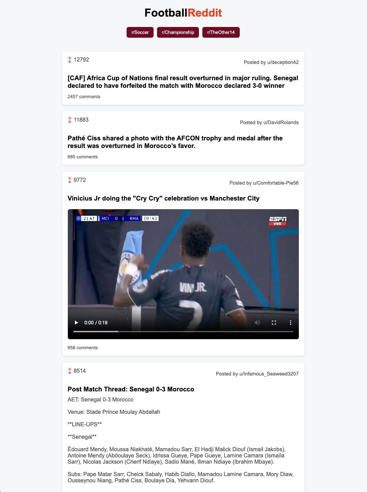

# ⚽ Football Reddit Client

A simple Reddit client built with React that allows users to browse top posts from popular football (soccer) subreddits.

---

## 📌 Features

* View top posts from:

  * r/soccer
  * r/Championship
  * r/TheOther14

* Switch between subreddits using navigation buttons
* Display:

  * Post title
  * Author
  * Upvotes
  * Images
  * Reddit-hosted videos
  * Post text (formatted)

* Responsive, card-based layout
* Loading and error states

---

## 🛠️ Built With

* React (Vite)
* JavaScript
* CSS Modules
* Reddit JSON API

---

## 📷 Screenshots

### Landing Page



---

## 🧠 What I Learned

This project helped me to:

* Build reusable React components
* Manage state using hooks (`useState`, `useEffect`)
* Work with external APIs
* Handle loading and error states
* Conditionally render UI elements
* Structure a scalable React project
* Use CSS Modules for scoped styling

---

## ⚙️ Installation & Setup

Clone the repository:

```bash
git clone https://github.com/your-username/your-repo-name.git
cd your-repo-name
```

Install dependencies:

```bash
npm install
```

Run the development server:

```bash
npm run dev
```

Open in browser:

```
http://localhost:5173
```

---

## 🔌 API

This project uses Reddit’s public JSON endpoints:

```
https://www.reddit.com/r/{subreddit}/top.json
```

---

## ⚠️ Known Issues

* Reddit API requests are blocked in deployed environments due to CORS restrictions - ACTIVELY WORKING ON FIX
* Some external media (e.g. YouTube, Twitter videos) are not supported
* Occasional rate limiting from Reddit

---

## 🙌 Acknowledgements

* Project brief from Codecademy Full-Stack Engineer Career Path
* Reddit API for public data

---

## 📄 License

This project is open source and available under the MIT License.

